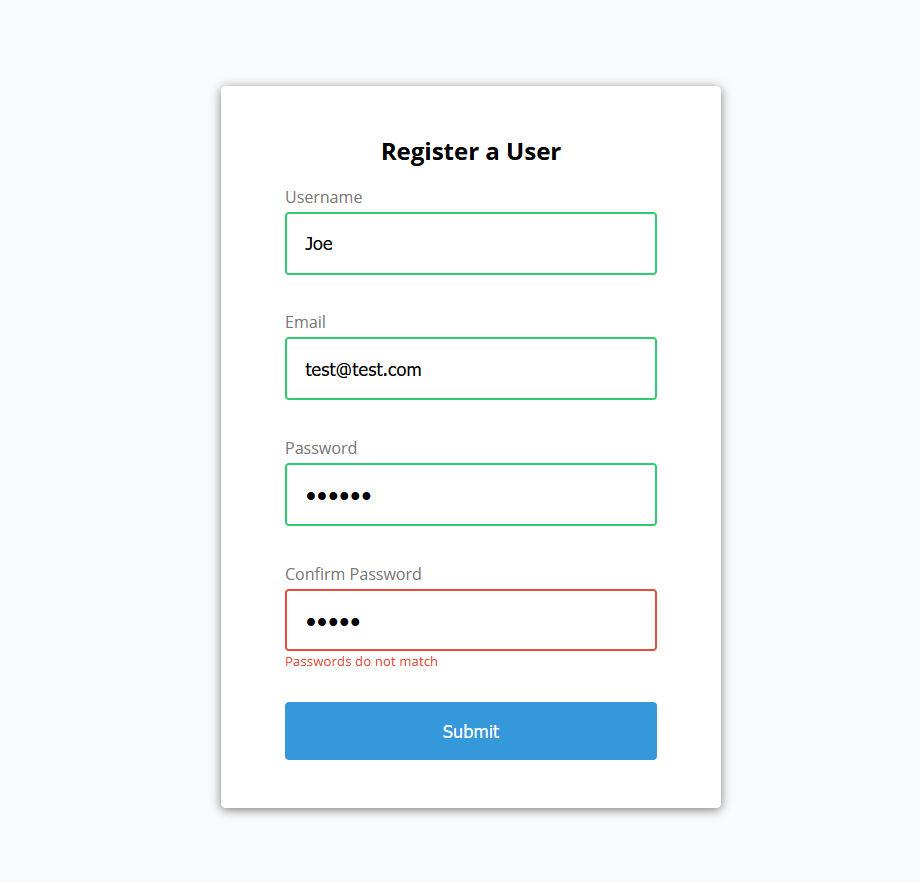

# Vanilla JS Mini Projects 

### Form Validator (Front-End)
* Check username: 
  * Has a min character length of 3
  * Has a max character length of 15
* Check email: 
  * Using RegEx - check if the email is in a valid format
* Check passwords: 
  * Has a min character length of 6
  * Has a max character length of 25
  * Check if passwords match 
* Error styling 
* Success styling 

